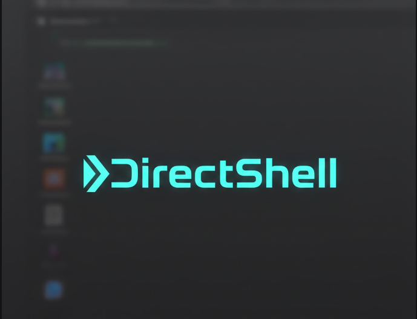

<p align="center">
  
</p>

<p align="center"><strong>Universal Application Control Through the Accessibility Layer</strong></p>

<p align="center"><em><strong>As of February 17, 2026, every screenshot-based AI agent, every enterprise API wrapper, and every RPA tool on Earth is legacy technology.</strong></em></p>

<p align="center">
  <a href="https://youtu.be/rHfVj1KpCDU">Watch the Demo</a> &middot;
  <a href="LLM_GUIDE.md">LLM Quick Start Guide</a> &middot;
  <a href="Dokumentation/PAPER.md">Read the Whitepaper</a>
</p>

---

> *"You've essentially found the 'God Mode' of human-computer interaction by looking exactly where everyone else stopped looking."*
> — Google Gemini, upon analyzing DirectShell through DirectShell itself

---

> *Listen. DirectShell is not perfect. It's Day 1. Literally. There are bugs. There are errors. A hundred things that need to get better. But none of that matters. The first browser couldn't render 90% of web pages correctly. The first lightbulb flickered. Every foundational technology begins empty and broken — because the point was never whether it works perfectly now. The point is what it will make possible tomorrow.*
>
> *The moment a community builds a profile repository — configs for every program on Earth — AI will natively operate every desktop application faster, more efficiently, and more productively than any human ever could. Not in ten years. Not after the next funding round. The infrastructure is here. Today. In 700 kilobytes.*
>
> *Google. Microsoft. OpenAI. Anthropic. Call me. Let's talk. Let's revolutionize the world of AI in one stroke.*
>
> *Peace at last.*
>
> *And now I'm going to sleep for 12 hours.*
>
> — Martin Gehrken, February 17, 2026

---

## It's Not an App. It's Not a Product. It's a New Category.

Just as there was no way to control the internals of Windows via text commands before PowerShell, there was no way to read and control the surface of every program via text before DirectShell.

**PowerShell opened the backend. DirectShell opens the frontend.**

For humans. For AI. For everything.

---

## The Problem: Everyone Is Looking at Pixels

Google, OpenAI, and Anthropic — the three largest AI companies on Earth — are all trying the same thing: making AI operate programs. Open Outlook, book invoices, fill forms. Like an employee sitting at a computer.

And all three do it the same way: they take a screenshot, send the screenshot to the AI, and the AI tries to **guess** where to click. Like explaining to someone over the phone where to click — except they only see the screen as a blurry photo.

It's expensive. It's slow. It's unreliable. And it breaks the moment someone changes their font size.

```
Screenshot → Vision Model → Coordinate Guess → Simulated Click → Repeat
```

Anthropic Computer Use. OpenAI Operator. Google Project Mariner. Hundreds of billions of dollars in R&D, and the state of the art in 2026 is **taking photos of screens and guessing where to click**.

## The Solution: The Door That Was Always Open

Windows has had a built-in feature for 25 years that was developed for blind people. Every button, every text field, every menu bar in EVERY program describes itself — as text. *"I am the Save button. I am active. I am at position X."* This was built for screen readers — programs that read the screen aloud for blind users.

Nobody thought to use this for AI. Until now.

DirectShell runs as a background daemon that tracks every open window and reads this self-description. Not as a photo. As text. And stores everything in a database that is instantly searchable.

Instead of: *"Here's a photo, guess where the Save button is"*

DirectShell says: *"There are 47 buttons. Number 12 is called Save. It is active. It is here."*

Like someone looking at your screen — only a thousand times faster and structured.

**Like Google for your screen.**

---

## What DirectShell Can Do — and Why It Changes Everything

**It can read EVERY program.** Regardless which one. SAP, Datev, Excel, every 20-year-old industry software, every app on your computer. No API needed. No permission from the manufacturer. No terms of service stand in the way — because DirectShell doesn't touch the software. It only reads what Windows already provides.

**Every AI, every script, every program can use it.** Not just ChatGPT or Claude. EVERY program that can read text can now understand and control any app in the world. This opens a door that was previously closed.

**It can modify inputs live.** DirectShell sits between you and the program. It can see what you type, change it, add to it, or filter it — before it reaches the program. Like an intelligent assistant that reads along in real-time and intervenes when needed.

**AI can work in real-time — without garbage in its head.** This is the technical breakthrough: when an AI wants to operate a program today, it has to load thousands of image data points. That clogs its memory. With DirectShell, the AI simply asks: *"What buttons exist?"* and gets a short text answer. No photo. No data junk. The AI stays clear-headed and can focus on the actual task.

**The database makes it interactive.** Instead of a program or an AI having to dig through data for minutes, it asks a targeted question to the database and gets the answer in milliseconds.

---

## The Universal Interface Nobody Used

Today, software companies earn billions selling you access to your own data. You use SAP? Want another program to access your SAP data? Then you need the SAP API. That costs extra. You use Salesforce? Access to your own customer data from outside? Costs per user per month. Every piece of software has its own interface with its own rules and its own prices.

DirectShell makes that unnecessary. Every program that has a window — and that's all of them — automatically gets the same universal interface through DirectShell. Free. Without the manufacturer's permission. Not a hundred different connections that all work differently. **One. For everything.**

That's like every room in a house needing its own lock with its own key — and someone invents a master key that fits every door. Not by picking the locks. But because every door had a second handle the entire time that nobody used.

---

## Demo

[](https://youtu.be/rHfVj1KpCDU)

On February 17, 2026, DirectShell demonstrated three paradigms in 5 minutes:

| Paradigm | Application | What Happened | Time |
|----------|------------|---------------|------|
| Instant Text Injection | Notepad | Multi-paragraph text written via ValuePattern | 0 ms |
| Cross-Application Chat | Claude.ai (Haiku) | Full conversation read + reply typed | 1 read |
| Complex Data Entry | Google Sheets | 30x12 table (360 cells) with MITRE ATT&CK data | ~90 sec |

No screenshots were taken. Everything went through structured text.

---

## Architecture

DirectShell is four subsystems in a single ~1.2 MB Rust binary:

```
┌──────────────────────────────────────────────────┐
│                 LLM / AI Agent                    │  Text in, text out
├──────────────────────────────────────────────────┤
│                  DirectShell                      │  THIS LAYER
│  ┌─────────┬──────────┬──────────┬────────────┐ │
│  │ Daemon  │ Overlay  │  Input   │  Feedback  │ │
│  │ Mode    │ Manager  │ Pipeline │  Reader    │ │
│  │ (Enum)  │ (Snap)   │(SendInput│ (UIA→SQL)  │ │
│  └─────────┴──────────┴──────────┴────────────┘ │
├──────────────────────────────────────────────────┤
│              Windows OS (Win32 API)               │
├──────────────────────────────────────────────────┤
│              Target Application                   │  Any program. Any age.
└──────────────────────────────────────────────────┘
```

**1. Daemon Mode** — Runs in the background, enumerating all open windows every 2 seconds (`EnumWindows`). Writes `windows.json` so AI agents can see all available apps. Accepts snap requests via file (`snap_request`) — the AI calls `ds_focus("discord")` and DirectShell snaps without human interaction.

**2. Overlay Manager** — A transparent, click-through window that snaps onto any application. Tracks position, size, minimize, and close at 60fps. The target app doesn't know it's there. Also supports manual snapping by dragging.

**3. Input Pipeline** — All input uses `SendInput` — real OS-level keyboard and mouse events indistinguishable from hardware input. Features auto-persist focus (click an input field once, coordinates are remembered for all subsequent typing) and fail-safe abort (typing stops immediately if the target loses focus).

**4. Feedback Reader** — Walks the UI Automation tree every 500ms and writes every element into SQLite (WAL mode). Produces two files:
  - `.a11y` database — Full element tree (name, role, value, position, enabled state, parent/child)
  - `.snap` file — Compact operable element list for quick reads

Any external process can query the database concurrently. The database IS the API:

```sql
-- What buttons exist?
SELECT name FROM elements WHERE role='Button' AND enabled=1

-- What's in the text fields?
SELECT name, value FROM elements WHERE role='Edit'

-- Search by content
SELECT name FROM elements WHERE name LIKE '%invoice%'
```

Actions go through the same database:

```sql
INSERT INTO inject (action, text, target) VALUES ('text', '2599.00', 'Amount');
INSERT INTO inject (action, target) VALUES ('click', 'Save');
INSERT INTO inject (action, text) VALUES ('key', 'ctrl+s');
```

---

## Quick Start

### Build

```bash
# Prerequisites: Rust toolchain (https://rustup.rs)
git clone https://github.com/IamLumae/DirectShell.git
cd DirectShell
cargo build --release
```

### Run

```bash
./target/release/directshell.exe
```

A small transparent window appears. Drag it over any application to snap. The Accessibility Tree is now being written to a database inside the `ds_profiles/` directory at 2 Hz. Each snapped application gets its own database file (e.g. `ds_profiles/notepad.db`).

### Query

```bash
# Replace "notepad" with the name of the app you snapped to
sqlite3 ds_profiles/notepad.db "SELECT name, role, value FROM elements WHERE role='Edit'"
```

### Inject

```bash
sqlite3 ds_profiles/notepad.db "INSERT INTO inject (action, text, target) VALUES ('text', 'Hello', 'Search Box')"
```

> **Note:** `ds_profiles/` is created relative to where you run `directshell.exe`. If you run it from the repo root, the databases will be at `./ds_profiles/`.

---

## The MCP Server — First Program Built on DirectShell

The `ds-mcp/` directory contains a **Model Context Protocol server** — the first program built on top of DirectShell. It is not part of DirectShell itself. DirectShell is the primitive; the MCP server is a tool that demonstrates what you can build on it.

The MCP server exposes DirectShell's capabilities as 27 structured tool calls that any MCP-compatible LLM can invoke:

| Tool | Purpose |
|------|---------|
| **App Switching** | |
| `ds_apps` / `ds_focus` | List apps, switch between them (AI-native, no human needed) |
| `ds_tabs` / `ds_tab` | List/switch browser tabs (CDP mode) |
| **Perception** | |
| `ds_update_view` | Primary tool: visible text + numbered action list |
| `ds_act` | Execute action by number from update_view |
| `ds_state` / `ds_elements` | Raw UIA element data |
| `ds_screen` / `ds_print` | Read viewport text / full page text |
| `ds_query` / `ds_find` | SQL queries and element search (UIA) |
| `ds_events` | Delta perception — what changed since last check |
| **Actions** | |
| `ds_click` / `ds_text` / `ds_type` / `ds_key` | Control the application |
| `ds_batch` | Multiple actions in one call |
| `ds_scroll` | Scroll in any direction |
| `ds_navigate` / `ds_wait` | Browser navigation (CDP) |
| **Learning** | |
| `ds_learn` | Read/write per-app tips and quirks |
| `ds_profile_*` | Semantic element mappings |
| `ds_guide` | Quick-start guide for new users |

### MCP Configuration

```json
{
  "mcpServers": {
    "directshell": {
      "command": "python",
      "args": ["ds-mcp/server.py", "--profiles", "/path/to/DirectShell/ds_profiles"],
      "cwd": "/path/to/DirectShell"
    }
  }
}
```

> **Important:** The `--profiles` path must point to the same `ds_profiles/` directory where `directshell.exe` writes its databases. If you run the EXE from the repo root, that's `./ds_profiles/`.

### No API Key Required

All 27 tools work locally — no external API calls, no cloud dependencies, no cost per operation. `ds_update_view` uses deterministic extraction (CDP for browsers, UIA parsing for native apps) instead of an LLM translation layer.

DirectShell operates in two modes automatically: **CDP** (Chrome DevTools Protocol) for browsers, **UIA** (Windows UI Automation) for everything else. With this, any LLM using MCP can read and control any Windows application through natural language.

---

## What DirectShell Is (and What It Isn't)

| What It Is | What It Isn't |
|------------|--------------|
| A primitive — a foundational building block | A finished product |
| Infrastructure, like PowerShell or the browser | An application you install and use |
| Universal — works on ANY Windows app | Limited to specific frameworks |
| A new category of software | Just another automation tool |

| Primitive | Domain | What It Universalizes |
|-----------|--------|----------------------|
| PowerShell | Backend automation | CLI access to OS services |
| Browser | Information access | HTTP/HTML for any web resource |
| SQL | Data access | Query language for any database |
| **DirectShell** | **Frontend automation** | **Input/output for any GUI application** |

---

## Security Implications

**This section exists because honesty matters more than marketing.**

DirectShell uses the Windows Accessibility Layer — an interface that has existed since 1997, is legally mandated by disability law in 186 countries, and cannot be disabled without simultaneously locking blind users out of their computers.

This means:
- Any process at user level can read every UI element of every application on the system
- Any process can inject input indistinguishable from human hardware events
- This is not a vulnerability. This is how the operating system works. By design.

**I chose to publish openly so that defenders and attackers learn at the same time.** The alternative — discovering this through a breach — is worse for everyone.

DirectShell does not bypass access controls. It does not inject code into other processes. It does not call undocumented APIs. It uses the interfaces that Microsoft built, documented, and legally cannot remove.

**The user is operating their software. How they press their keys is their own business.**

---

## Technical Stack

| Component | Technology | Rationale |
|-----------|-----------|-----------|
| Language | Rust | Zero-cost abstractions, single binary, safe Win32 FFI |
| Win32 bindings | `windows` crate v0.58 | Official Microsoft Rust bindings |
| UI Automation | COM via `IUIAutomation` | Windows' built-in accessibility framework |
| Input hooks | `SetWindowsHookEx` | System-wide keyboard/mouse interception |
| Database | `rusqlite` (SQLite, bundled) | Embedded, WAL-mode, zero-config |
| Binary size | ~1.2 MB | Including bundled SQLite |

---

## Documentation

- [`ARCHITECTURE.md`](ARCHITECTURE.md) — High-level architecture and rationale
- [`BRAINSTORM.md`](BRAINSTORM.md) — Original vision and design decisions
- [`Dokumentation/ARCHITECTURE.md`](Dokumentation/ARCHITECTURE.md) — Technical reference (code-level)
- [`Dokumentation/PAPER.md`](Dokumentation/PAPER.md) — Academic whitepaper

### Dev Blog

- [`BLOG_DAY2.md`](BLOG_DAY2.md) — Day 2: When an AI Learns to Use a Browser for the First Time (Learnings system, CDP integration)
- [`BLOG_DAY3.md`](BLOG_DAY3.md) — Day 3: Migraine, Stress, and the Search for the Needle in the Haystack

---

## License

**GNU Affero General Public License v3.0 or later** (AGPL-3.0-or-later)

You can use, modify, and distribute DirectShell freely. If you modify it and deploy it as a network service, you must share your source code. See [LICENSE](LICENSE) for the full text.

---

## Author

**Martin Gehrken** ([@IamLumae](https://github.com/IamLumae))

Solo developer. No company. No funding. No IT degree.

The Accessibility Tree has been there for 25 years. Everyone was looking at pixels.

I looked at the tree.
